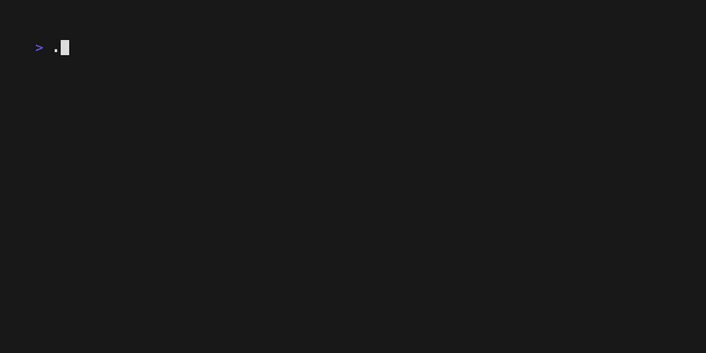

# Fremorizer

TUI written in go to help you memorize the guitar fretboard utilizing [bubbletea](https://github.com/charmbracelet/bubbletea) TUI framework<br>

You can either explore the fretboard on your own:


You can guess random notes:


You can find notes in a set of 3 frets:


There are a lot of options including different Instruments and custom tunings:



## Installation

### SSH

You can run the game directly via ssh:

```bash
ssh -p 2222 fremorizer.com
```

### Go install / Binary

**Using `go install`** (requires Go 1.25+):

```bash
go install github.com/funkymcb/fremorizer@latest
```

**Download a pre-built binary**

Grab the latest release for your platform from the [releases page](https://github.com/funkymcb/fremorizer/releases), extract the archive and move the binary to a directory on your `PATH`:

```bash
# Example for Linux amd64
tar -xzf fremorizer-<version>-linux-amd64.tar.gz
mv fremorizer /usr/local/bin/
```

**Docker**

```bash
docker pull ghcr.io/funkymcb/fremorizer:latest
docker run -it --rm ghcr.io/funkymcb/fremorizer:latest
```

**Build from source**

```bash
git clone https://github.com/funkymcb/fremorizer.git
cd fremorizer
go build -o fremorizer .
./fremorizer
```

<!-- ## Structure -->

<!---->

<!-- ### Choose game mode -->

<!---->

<!-- At the start of the application you can choose between 3 different game modes. -->

<!---->

<!-- 1. Determine a random note per string -->

<!-- 1. Determine random notes per fret set (set of 3 frets) -->

<!-- 1. Determine the notes of various chords -->

<!---->

<!-- ### Options -->

<!---->

<!-- #### Choose Instrument -->

<!---->

<!-- While being presented with the game mode list you can enter the options menu by pressing 'o'.<br> -->

<!-- This menu will allow you to pick an istrument from the following list: -->

<!---->

<!-- - guitar (default) -->

<!-- - bass -->

<!-- - ukulele -->

<!---->

<!-- #### Choose Number of strings -->

<!---->

<!-- For guitar and bass you can also change the number of strings.<br> -->

<!---->

<!-- - for Guitar from 6 (default) up to 8 strings. -->

<!-- - for Bass from 4 (default) up to 6 strings -->

<!---->

<!-- For Ukulele 4 strings is the only option. -->

<!---->

<!-- #### Choose tuning -->

<!---->

<!-- For guitar the standard tuning is E standard (E, A, D, G, B, E)<br> -->

<!-- For bass default tuning is is (E, A, D, G)<br> -->

<!-- For Ukulele default tuning is (G, C, E, A)<br> -->

<!-- You can change the tuning by changing the tuning for each string. -->

<!---->

<!-- #### Choose Number of frets -->

<!---->

<!-- For all instruments you can set the number of frets between 12 (default) and 24<br> -->

<!---->

<!-- ### Game layout -->

<!---->

<!-- #### Game mode 1 (random note per string) -->

<!---->

<!-- The basic layout looks like this: -->

<!---->

<!-- ```text -->

<!-- Fretboard: -->

<!--      1           3           5           7           9                12 -->

<!-- E |-----|-----|-----|-----|-----|-----|-----|-----|-----|-----|-----|-----| -->

<!-- B |-----|-----|-----|-----|-----|-----|-----|-----|-----|-----|-----|-----| -->

<!-- G |-----|-----|-----|-----|-----|-----|-----|-----|-----|-----|-----|-----| -->

<!-- D |-----|-----|-----|-----|-----|-----|-----|-----|-----|-----|-----|-----| -->

<!-- A |-----|-----|-----|-----|-----|-----|-----|-----|-----|-----|-----|-----| -->

<!-- E |-----|-----|-----|-----|-----|-----|-----|-----|-----|-----|-----|-----| -->

<!---->

<!-- Pleas enter your guess: _ -->

<!-- ``` -->

<!---->

<!-- In game mode 1 (1 note per string) the note to be determined will look like this '(?)' with a blinking questionmark.<br> -->

<!-- Beneath this view you can type your guess. When guessed right the note will be shown in the layout with a green fill.<br> -->

<!-- The note will disappear but the location will stay green.<br> -->

<!-- When guessed wrong three times the note will be shown as well but with a red fill.<br> -->

<!-- You will then cycle through all the notes until every note is green. The red notes you can try again after cycling through.<br> -->

<!-- When all notes are green the game is over and you will be redirected to the initial game menu to choose a mode. -->

<!---->

<!-- ```text -->

<!-- Blinking Note: -->

<!--      1           3           5           7           9                12 -->

<!-- E |-----|-----|-----|-----|-----|-----|-----|-----|-----|-----|-----|-----| -->

<!-- B |-----|-----|-----|-----|-----|-----|-----|-----|-----|-----|-----|-----| -->

<!-- G |-----|-----|-----|-(?)-|-----|-----|-----|-----|-----|-----|-----|-----| -->

<!-- D |-----|-----|-----|-----|-----|-----|-----|-----|-----|-----|-----|-----| -->

<!-- A |-----|-----|-----|-----|-----|-----|-----|-----|-----|-----|-----|-----| -->

<!-- E |-----|-----|-----|-----|-----|-----|-----|-----|-----|-----|-----|-----| -->

<!---->

<!-- Pleas enter your guess: _ -->

<!-- ``` -->

<!---->

<!-- #### Game mode 2 (Random note per fret set) -->

<!---->

<!-- In this game mode the layout will basically the same. But 3 frets strings will be highlighted with blue color and whitespace seperation from the other frets.<br> -->

<!-- The note to be determined will be shown at the top of the fretboard.<br> -->

<!-- You then need to go thorught the frets and mark (by pressing space or enter) every spot where this note appears within the 3 frets<br> -->

<!-- Marked notes will be marked with an 'x'<br> -->

<!-- You can navigate 2 dimensionally through the strings and frets wither with arrow keys or vim keys (h, j, k, l)<br> -->

<!-- When all occurances are marked the next note to be determined will be shown randomly -->

<!---->

<!-- ```text -->

<!-- Note to be Determined: C# -->

<!---->

<!-- Fretboard: -->

<!--      1             3           5             7           9                12 -->

<!-- E |-----|-----  |-----|-----|-----|  -----|-----|-----|-----|-----|-----|-----| -->

<!-- B |-----|-----  |-----|-----|-----|  -----|-----|-----|-----|-----|-----|-----| -->

<!-- G |-----|-----  |-----|-----|-----|  -----|-----|-----|-----|-----|-----|-----| -->

<!-- D |-----|-----  |-----|-----|-----|  -----|-----|-----|-----|-----|-----|-----| -->

<!-- A |-----|-----  |-----|--x--|-----|  -----|-----|-----|-----|-----|-----|-----| -->

<!-- E |-----|-----  |-----|-----|-----|  -----|-----|-----|-----|-----|-----|-----| -->

<!-- ``` -->

<!---->

<!-- #### Game mode 3 (notes per chord) -->

<!---->

<!-- For this game mode there are 3 levels of difficulty which can be set in the options menu. -->

<!---->

<!-- - easy (default): just basic major / minor chords -->

<!-- - medium: intervals are hidden and need to be marked by the player -->

<!-- - hard: like medium but with 7th and 9th chords added -->

<!---->

<!-- ##### easy game mode -->

<!---->

<!-- In this game mode a basic major or minor chord shape will be shown in a random position based on the CAGED system.<br> -->

<!-- For example: -->

<!---->

<!-- ```text -->

<!--       1           3           5           7           9                12 -->

<!-- E  |-----|-----|--1--|-----|-----|-----|-----|-----|-----|-----|-----|-----| -->

<!-- B  |-----|-----|--5--|-----|-----|-----|-----|-----|-----|-----|-----|-----| -->

<!-- G  |-----|-----|-----|--3--|-----|-----|-----|-----|-----|-----|-----|-----| -->

<!-- D  |-----|-----|-----|-----|--1--|-----|-----|-----|-----|-----|-----|-----| -->

<!-- A  |-----|-----|-----|-----|--5--|-----|-----|-----|-----|-----|-----|-----| -->

<!-- E  |-----|-----|--1--|-----|-----|-----|-----|-----|-----|-----|-----|-----| -->

<!---->

<!-- Which chord is this? _ -->

<!-- ``` -->

<!---->

<!-- At first you need to enter the chord, so in this case: Gm<br> -->

<!-- (minor will be shown with lowercase m, major will be shown either by just entering the note eg 'g' or with capital M eg 'gM')<br> -->

<!-- Then you are prompted with the intervals which you need to enter one after another.<br> -->

<!-- For example: "What is the root note (1) of this chords: G"<br> -->

<!-- Then: "What is the third (3): B"<br> -->

<!-- Then: "What is the perfect fifth (5): D"<br> -->

<!---->

<!-- Everytime you enter the correct interval the corresponding notes in the chord will be shown and filled green.<br> -->

<!-- For example when you entered the root note: -->

<!---->

<!-- ```text -->

<!--       1           3           5           7           9                12 -->

<!-- E  |-----|-----|--G--|-----|-----|-----|-----|-----|-----|-----|-----|-----| -->

<!-- B  |-----|-----|--5--|-----|-----|-----|-----|-----|-----|-----|-----|-----| -->

<!-- G  |-----|-----|-----|--3--|-----|-----|-----|-----|-----|-----|-----|-----| -->

<!-- D  |-----|-----|-----|-----|--G--|-----|-----|-----|-----|-----|-----|-----| -->

<!-- A  |-----|-----|-----|-----|--5--|-----|-----|-----|-----|-----|-----|-----| -->

<!-- E  |-----|-----|--G--|-----|-----|-----|-----|-----|-----|-----|-----|-----| -->

<!---->

<!-- Which chord is this? _ -->

<!-- ``` -->

<!---->

<!-- For open chords the intervals will be shown to the left of the fretboard, like: -->

<!---->

<!-- ```text -->

<!--       1           3           5           7           9                12 -->

<!-- E  |-----|--3--|-----|-----|-----|-----|-----|-----|-----|-----|-----|-----| -->

<!-- B  |-----|-----|--1--|-----|-----|-----|-----|-----|-----|-----|-----|-----| -->

<!-- G  |-----|--5--|-----|-----|-----|-----|-----|-----|-----|-----|-----|-----| -->

<!-- D 1|-----|-----|-----|-----|-----|-----|-----|-----|-----|-----|-----|-----| -->

<!-- A x|-----|-----|-----|-----|-----|-----|-----|-----|-----|-----|-----|-----| -->

<!-- E x|-----|-----|-----|-----|-----|-----|-----|-----|-----|-----|-----|-----| -->

<!-- ``` -->

<!---->

<!-- ###### Basic major chord shapes: -->

<!---->

<!-- C major shape: -->

<!---->

<!-- ```text -->

<!--       1           3           5           7           9                12 -->

<!-- E  |-----|--3--|-----|-----|-----|-----|-----|-----|-----|-----|-----|-----| -->

<!-- B  |-----|-----|--1--|-----|-----|-----|-----|-----|-----|-----|-----|-----| -->

<!-- G  |-----|--5--|-----|-----|-----|-----|-----|-----|-----|-----|-----|-----| -->

<!-- D  |-----|-----|-----|--3--|-----|-----|-----|-----|-----|-----|-----|-----| -->

<!-- A  |-----|-----|-----|-----|--1--|-----|-----|-----|-----|-----|-----|-----| -->

<!-- E x|-----|-----|-----|-----|-----|-----|-----|-----|-----|-----|-----|-----| -->

<!-- ``` -->

<!---->

<!-- A major shape: -->

<!---->

<!-- ```text -->

<!--       1           3           5           7           9                12 -->

<!-- E  |-----|-----|--5--|-----|-----|-----|-----|-----|-----|-----|-----|-----| -->

<!-- B  |-----|-----|-----|-----|--3--|-----|-----|-----|-----|-----|-----|-----| -->

<!-- G  |-----|-----|-----|-----|--1--|-----|-----|-----|-----|-----|-----|-----| -->

<!-- D  |-----|-----|-----|-----|--5--|-----|-----|-----|-----|-----|-----|-----| -->

<!-- A  |-----|-----|--1--|-----|-----|-----|-----|-----|-----|-----|-----|-----| -->

<!-- E x|-----|-----|-----|-----|-----|-----|-----|-----|-----|-----|-----|-----| -->

<!-- ``` -->

<!---->

<!-- G major shape: -->

<!---->

<!-- ```text -->

<!--       1           3           5           7           9                12 -->

<!-- E  |-----|-----|-----|-----|--1--|-----|-----|-----|-----|-----|-----|-----| -->

<!-- B  |-----|--3--|-----|-----|-----|-----|-----|-----|-----|-----|-----|-----| -->

<!-- G  |-----|--1--|-----|-----|-----|-----|-----|-----|-----|-----|-----|-----| -->

<!-- D  |-----|--5--|-----|-----|-----|-----|-----|-----|-----|-----|-----|-----| -->

<!-- A  |-----|-----|-----|--3--|-----|-----|-----|-----|-----|-----|-----|-----| -->

<!-- E  |-----|-----|-----|-----|--1--|-----|-----|-----|-----|-----|-----|-----| -->

<!-- ``` -->

<!---->

<!-- E major shape: -->

<!---->

<!-- ```text -->

<!--       1           3           5           7           9                12 -->

<!-- E  |-----|-----|--1--|-----|-----|-----|-----|-----|-----|-----|-----|-----| -->

<!-- B  |-----|-----|--5--|-----|-----|-----|-----|-----|-----|-----|-----|-----| -->

<!-- G  |-----|-----|-----|--3--|-----|-----|-----|-----|-----|-----|-----|-----| -->

<!-- D  |-----|-----|-----|-----|--1--|-----|-----|-----|-----|-----|-----|-----| -->

<!-- A  |-----|-----|-----|-----|--5--|-----|-----|-----|-----|-----|-----|-----| -->

<!-- E  |-----|-----|--1--|-----|-----|-----|-----|-----|-----|-----|-----|-----| -->

<!-- ``` -->

<!---->

<!-- D major shape: -->

<!---->

<!-- ```text -->

<!--       1           3           5           7           9                12 -->

<!-- E  |-----|-----|-----|--3--|-----|-----|-----|-----|-----|-----|-----|-----| -->

<!-- B  |-----|-----|-----|-----|--1--|-----|-----|-----|-----|-----|-----|-----| -->

<!-- G  |-----|-----|-----|--5--|-----|-----|-----|-----|-----|-----|-----|-----| -->

<!-- D  |-----|--1--|-----|-----|-----|-----|-----|-----|-----|-----|-----|-----| -->

<!-- A x|-----|-----|-----|-----|-----|-----|-----|-----|-----|-----|-----|-----| -->

<!-- E x|-----|-----|-----|-----|-----|-----|-----|-----|-----|-----|-----|-----| -->

<!-- ``` -->

<!---->

<!-- ###### Basic minor chord shapes: -->

<!---->

<!-- C minor shape: -->

<!---->

<!-- ```text -->

<!--       1           3           5           7           9                12 -->

<!-- E x|-----|-----|-----|-----|-----|-----|-----|-----|-----|-----|-----|-----| -->

<!-- B  |-----|-----|--1--|-----|-----|-----|-----|-----|-----|-----|-----|-----| -->

<!-- G  |-----|--5--|-----|-----|-----|-----|-----|-----|-----|-----|-----|-----| -->

<!-- D  |-----|-----|-b3--|-----|-----|-----|-----|-----|-----|-----|-----|-----| -->

<!-- A  |-----|-----|-----|-----|--1--|-----|-----|-----|-----|-----|-----|-----| -->

<!-- E x|-----|-----|-----|-----|-----|-----|-----|-----|-----|-----|-----|-----| -->

<!-- ``` -->

<!---->

<!-- A minor shape: -->

<!---->

<!-- ```text -->

<!--       1           3           5           7           9                12 -->

<!-- E  |-----|-----|--5--|-----|-----|-----|-----|-----|-----|-----|-----|-----| -->

<!-- B  |-----|-----|-----|-b3--|-----|-----|-----|-----|-----|-----|-----|-----| -->

<!-- G  |-----|-----|-----|-----|--1--|-----|-----|-----|-----|-----|-----|-----| -->

<!-- D  |-----|-----|-----|-----|--5--|-----|-----|-----|-----|-----|-----|-----| -->

<!-- A  |-----|-----|--1--|-----|-----|-----|-----|-----|-----|-----|-----|-----| -->

<!-- E x|-----|-----|-----|-----|-----|-----|-----|-----|-----|-----|-----|-----| -->

<!-- ``` -->

<!---->

<!-- G minor shape: -->

<!---->

<!-- ```text -->

<!--       1           3           5           7           9                12 -->

<!-- E  |-----|-----|-----|-----|--1--|-----|-----|-----|-----|-----|-----|-----| -->

<!-- B  |-----|-----|-----|-----|--5--|-----|-----|-----|-----|-----|-----|-----| -->

<!-- G  |-----|--1--|-----|-----|-----|-----|-----|-----|-----|-----|-----|-----| -->

<!-- D  |-----|--5--|-----|-----|-----|-----|-----|-----|-----|-----|-----|-----| -->

<!-- A  |-----|-----|-b3--|-----|-----|-----|-----|-----|-----|-----|-----|-----| -->

<!-- E  |-----|-----|-----|-----|--1--|-----|-----|-----|-----|-----|-----|-----| -->

<!-- ``` -->

<!---->

<!-- E minor shape: -->

<!---->

<!-- ```text -->

<!--       1           3           5           7           9                12 -->

<!-- E  |-----|-----|--1--|-----|-----|-----|-----|-----|-----|-----|-----|-----| -->

<!-- B  |-----|-----|--5--|-----|-----|-----|-----|-----|-----|-----|-----|-----| -->

<!-- G  |-----|-----|-b3--|-----|-----|-----|-----|-----|-----|-----|-----|-----| -->

<!-- D  |-----|-----|-----|-----|--1--|-----|-----|-----|-----|-----|-----|-----| -->

<!-- A  |-----|-----|-----|-----|--5--|-----|-----|-----|-----|-----|-----|-----| -->

<!-- E  |-----|-----|--1--|-----|-----|-----|-----|-----|-----|-----|-----|-----| -->

<!-- ``` -->

<!---->

<!-- D minor shape: -->

<!---->

<!-- ```text -->

<!--       1           3           5           7           9                12 -->

<!-- E  |-----|-----|-b3--|-----|-----|-----|-----|-----|-----|-----|-----|-----| -->

<!-- B  |-----|-----|-----|-----|--1--|-----|-----|-----|-----|-----|-----|-----| -->

<!-- G  |-----|-----|-----|--5--|-----|-----|-----|-----|-----|-----|-----|-----| -->

<!-- D  |-----|--1--|-----|-----|-----|-----|-----|-----|-----|-----|-----|-----| -->

<!-- A x|-----|-----|-----|-----|-----|-----|-----|-----|-----|-----|-----|-----| -->

<!-- E x|-----|-----|-----|-----|-----|-----|-----|-----|-----|-----|-----|-----| -->

<!-- ``` -->

<!---->

<!-- ##### medium game mode -->

<!---->

<!-- The medium difficulty is similar to easy with a few minor changes.<br> -->

<!-- It works with the same chords as easy but the intervals are hidden: -->

<!---->

<!-- ```text -->

<!--       1           3           5           7           9                12 -->

<!-- E  |-----|-----|--x--|-----|-----|-----|-----|-----|-----|-----|-----|-----| -->

<!-- B  |-----|-----|-----|-----|--x--|-----|-----|-----|-----|-----|-----|-----| -->

<!-- G  |-----|-----|-----|--x--|-----|-----|-----|-----|-----|-----|-----|-----| -->

<!-- D  |-----|--x--|-----|-----|-----|-----|-----|-----|-----|-----|-----|-----| -->

<!-- A x|-----|-----|-----|-----|-----|-----|-----|-----|-----|-----|-----|-----| -->

<!-- E x|-----|-----|-----|-----|-----|-----|-----|-----|-----|-----|-----|-----| -->

<!-- ``` -->

<!---->

<!-- The player needs to define the chord name like before and then needs to name the intervals.<br> -->

<!-- As an additional step you need to mark the interval on the fretboard. -->

<!---->

<!-- #### Game mode 4 (free learning) -->

<!---->

<!-- In this game mode you have a free cursor over the fretboard.<br> -->

<!-- With that cursor you can do multiple things. -->

<!---->

<!-- pressing... -->

<!---->

<!-- - 'space': will reveal the note under the cursor -->

<!-- - 's': will reveal the notes of the whole string under the cursor -->

<!-- - 'f': will revel the notes of the fret under the cursor -->

<!-- - 'm': will reveal a minor scale from the cursor position -->

<!-- - 'M': will reveal a major scale from the cursor position -->

<!---->

<!-- The scales should look like the following:<br> -->

<!---->

<!-- Major scale (w w h w w w h)<br> -->

<!-- Example with cursor on low e string third fret and 'M' for major scale: -->

<!---->

<!-- ```text -->

<!--       1           3           5           7           9                12 -->

<!-- E  |-----|-----|-----|-----|-----|-----|-----|-----|-----|-----|-----|-----| -->

<!-- B  |-----|-----|-----|-----|-----|-----|-----|-----|-----|-----|-----|-----| -->

<!-- G  |-----|-----|-----|-----|-----|-----|-----|-----|-----|-----|-----|-----| -->

<!-- D  |-----|--E--|-----|-F#--|--G--|-----|-----|-----|-----|-----|-----|-----| -->

<!-- A  |-----|--B--|--C--|-----|--D--|-----|-----|-----|-----|-----|-----|-----| -->

<!-- E  |-----|-----|--G--|-----|--A--|-----|-----|-----|-----|-----|-----|-----| -->

<!-- ``` -->

<!---->

<!-- Minor scale (w h w w h w w) -->

<!-- Example with cursor on low e string third fret and 'm' for major scale: -->

<!---->

<!-- ```text -->

<!--       1           3           5           7           9                12 -->

<!-- E  |-----|-----|-----|-----|-----|-----|-----|-----|-----|-----|-----|-----| -->

<!-- B  |-----|-----|-----|-----|-----|-----|-----|-----|-----|-----|-----|-----| -->

<!-- G  |-----|-----|-----|-----|-----|-----|-----|-----|-----|-----|-----|-----| -->

<!-- D  |-----|-----|--F--|-----|--G--|-----|-----|-----|-----|-----|-----|-----| -->

<!-- A  |-----|-----|--C--|-----|--D--|-Eb--|-----|-----|-----|-----|-----|-----| -->

<!-- E  |-----|-----|--G--|-----|--A--|-Bb--|-----|-----|-----|-----|-----|-----| -->

<!-- ``` -->

<!---->

<!-- For all examples on the A string the layout looks the same.<br> -->

<!-- For Strings D and G the warp between 4th and 5th string needs to be considered of course.<br> -->

<!---->

<!-- Complex example A# Major scale with cursor on G string third fret and M for Major pressed: -->

<!---->

<!-- ```text -->

<!--       1           3           5           7           9                12 -->

<!-- E  |-----|-----|-F##-|-----|-G##-|-A#--|-----|-----|-----|-----|-----|-----| -->

<!-- B  |-----|-----|-C##-|-D#--|-----|-E#--|-----|-----|-----|-----|-----|-----| -->

<!-- G  |-----|-----|--A#-|-----|-B#--|-----|-----|-----|-----|-----|-----|-----| -->

<!-- D  |-----|-----|-----|-----|-----|-----|-----|-----|-----|-----|-----|-----| -->

<!-- A  |-----|-----|-----|-----|-----|-----|-----|-----|-----|-----|-----|-----| -->

<!-- E  |-----|-----|-----|-----|-----|-----|-----|-----|-----|-----|-----|-----| -->

<!-- ``` -->
